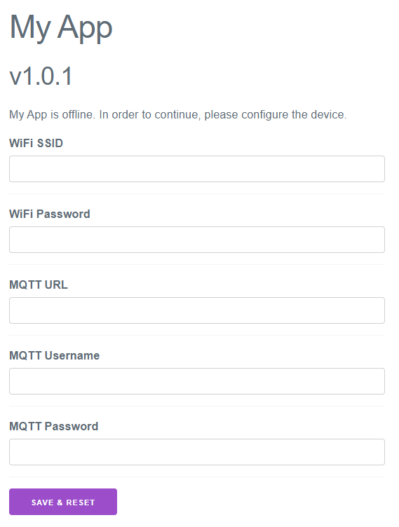

# Examples

## Device info
[examples/device_info.cpp](device_info.cpp) provides access to device internal information such as free/used heap, unique ID, ...

## Storage
[examples/storage.cpp](storage.cpp)

## Config
[examples/config.cpp](config.cpp) provides convenient way for storing/loading configuration values. Uses `essentials::PersistentStorage`.

## Settings server
[examples/settings_server.cpp](settings_server.cpp) runs web server for setting up configuration values such as SSID, passwords, etc. Uses `essentials::Config`.



## WiFi
[examples/wifi.cpp](wifi.cpp) connects to WiFi or create AP.

## MQTT
[examples/mqtt.cpp](mqtt.cpp) connects to MQTT server. Uses all previous examples.

## Details
- Good app (can visualize values in charts) for testing MQTT: http://mqtt-explorer.com/

- Binary which uses WiFi and MQTT has approximately 1MB thus you might need to adjust main partition size in `partitions.csv`:
    ```
    # ESP-IDF Partition Table
    # Name,   Type, SubType, Offset,  Size, Flags
    nvs,      data, nvs,     0x9000,  0x6000,
    phy_init, data, phy,     0xf000,  0x1000,
    factory,  app,  factory, 0x10000, 2M, # <--
    ```

- Library uses exceptions and C++20 features thus you must enable them

- Root certificate can be obtained with: 
    ```bash
    echo "" | openssl s_client -showcerts -connect my.mqtt.com:8883 | sed -n "1,/Root/d; /BEGIN/,/END/p" | openssl x509 -outform PEM > cert.pem
    ```
    Replace `my.mqtt.com:8883` with MQTT broker's address.
    
    To use certificate edit your root `CMakeLists.txt`:
    ```cmake
    cmake_minimum_required(VERSION 3.5)

    set(CMAKE_CXX_STANDARD 20)

    include($ENV{IDF_PATH}/tools/cmake/project.cmake)
    project(my-esp-idf-project)

    target_add_binary_data(${CMAKE_PROJECT_NAME}.elf "components/essentials/resources/web/dist/app.js.gz" TEXT)
    target_add_binary_data(${CMAKE_PROJECT_NAME}.elf "components/essentials/resources/web/dist/index.html.gz" TEXT)
    
    target_add_binary_data(${CMAKE_PROJECT_NAME}.elf "main/cert.pem" TEXT) # <--
    ```
    And use linked cert data in code:
    ```cpp
    extern const uint8_t mqttCertBegin[] asm("_binary_cert_pem_start");
    extern const uint8_t mqttCertEnd[] asm("_binary_cert_pem_end");
    ```
- HTTP settings server might return `431 Request Header Fields Too Large` code on some browsers. Error response: `Header fields are too long for server to interpret`. To solve this issue change `HTTPD_MAX_REQ_HDR_LEN` to at 1024 in `idf.py menuconfig`.
